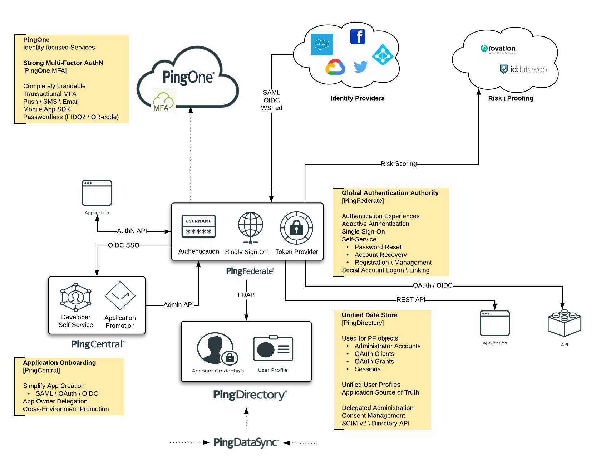

# Solution - Customer360

The Ping **Customer360** Solution provides a CIAM package for PingDirectory \ PingFederate \ PingDataSync

---

## Pre-Requisites

* PingID SDK Tenant / SDK Application
  * Logon to [PingOne Admin](https://admin.pingone.com)
  * Download PingID SDK Properties file (Setup --> PingID --> Client Integrations --> Integrate with PingID SDK)
  * Create SDK Application (Applications --> PingID SDK Applications)
    * Enable Email / SMS (Application --> Configuration)

## Deployment

This repo contains 2 configuration sets for deployment:

* [Docker Compose](deployment/Compose)
* [Kubernetes](deployment/Kubernetes)

### Deployment Configuration

The bulk of the configuration is performed by a Postman API Collection:  
[Customer360 - Postman Collection](https://documenter.getpostman.com/view/1239082/SzRw2Axv)

[Environment Variables](deployment)

[Post Deployment Considerations](docs/post-deployment.md)

## Solution Configuration

| Product | Console URL |
| ----- | ----- |
| [PingCentral](docs/solution-pc.md) | `https://{{PC_HOSTNAME}}:9022` |
| [PingDataSync](docs/solution-pd.md) | `https://{{PD_HOSTNAME}}:8443/console` |
| [PingDirectory](docs/solution-pd.md) | `https://{{PD_HOSTNAME}}:8443/console` |
| [PingFederate](docs/solution-pf.md) | `https://{{PF_HOSTNAME}}:9999/pingfederate` |
| PingID SDK | `https://admin.pingone.com` |
